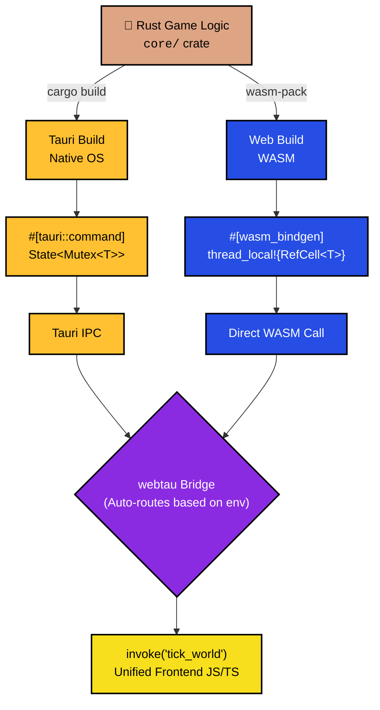

# gametau

[](https://npmjs.com/package/webtau)
[](https://crates.io/crates/webtau)
[](https://github.com/devallibus/gametau/actions/workflows/ci.yml)
[](LICENSE)
[](https://github.com/devallibus/gametau)

A toolkit for building games in Rust that run in the browser (WASM) and on desktop from one codebase.

**[Play the Battlestation demo in your browser →](https://gametau.devallibus.com/battlestation/)**

---

## What is gametau?

Tauri is the right choice for the desktop side of a Rust game. But Tauri has no web target — `invoke()` routes through IPC that only exists inside the Tauri process. Without something to bridge that gap, your dev loop is locked to `tauri dev`, you can't share a playable build without shipping a native installer, and your simulation code can only ever run on desktop.

gametau gives you the web build back without touching your game logic. You write Rust once; the toolkit compiles it to both a native desktop binary (via Tauri) and a WASM module (via wasm-pack), and routes your frontend's `invoke("command")` calls to whichever is available at runtime — automatically.

Three packages work together:

- **`webtau`** (npm + Rust crate) — the runtime bridge. Routes `invoke()` calls to Tauri IPC on desktop and to direct WASM calls in the browser. Includes shims for Tauri's filesystem, dialog, window, event, and path APIs so the same import paths work on both targets.
- **`webtau-vite`** — the build plugin. Compiles your Rust to WASM on save, watches for changes, and hot-reloads your browser tab. Zero config for the standard project layout.
- **`create-gametau`** — the scaffolder. Generates a ready-to-run project with the Rust workspace, Vite config, and TypeScript service layer already wired up.

---

## Getting Started

### 1. Scaffold a new project

```bash
bunx create-gametau my-game              # Three.js (default)
bunx create-gametau my-game -t pixi      # PixiJS
bunx create-gametau my-game -t vanilla   # Canvas2D

cd my-game
bun install
bun run dev                              # Opens localhost:1420 in your browser
```

That's it. Your game is running as WASM in the browser with hot-reload on Rust file saves.

### 2. Prerequisites

- [Rust](https://rustup.rs/) with the `wasm32-unknown-unknown` target
- [wasm-pack](https://rustwasm.github.io/wasm-pack/installer/) — required for WASM builds and hot-reload
- [Bun](https://bun.sh/) (or Node.js 18+)
- [Tauri CLI](https://v2.tauri.app/start/create-project/) — only needed for desktop builds

```bash
rustup target add wasm32-unknown-unknown
cargo install wasm-pack
bun add -g @tauri-apps/cli    # optional — only for desktop builds
```

### 3. Write game logic in Rust

Start with a pure Rust crate. No Tauri, no WASM imports — just your game state and logic.

```rust
// src-tauri/core/src/lib.rs
use serde::Serialize;

#[derive(Serialize)]
pub struct WorldView { pub score: i32 }

#[derive(Serialize)]
pub struct TickResult { pub score_delta: i32 }

pub struct GameWorld { score: i32 }

impl GameWorld {
    pub fn new() -> Self { Self { score: 0 } }
    pub fn view(&self) -> WorldView { WorldView { score: self.score } }
    pub fn tick(&mut self) -> TickResult {
        self.score += 1;
        TickResult { score_delta: 1 }
    }
}
```

The `core/` crate is pure Rust with no framework dependencies. Reuse it for a multiplayer server, a CLI tool, or any future target without modification.

### 4. Define commands once

Use `#[webtau::command]` to write each command once. The macro generates both the Tauri and WASM wrappers automatically — you never write them by hand.

```rust
// src-tauri/commands/src/commands.rs
use my_game_core::{GameWorld, WorldView, TickResult};

#[cfg(target_arch = "wasm32")]
webtau::wasm_state!(GameWorld);

#[cfg(target_arch = "wasm32")]
#[wasm_bindgen::prelude::wasm_bindgen]
pub fn init() { set_state(GameWorld::new()); }

#[webtau::command]
pub fn get_world_view(state: &GameWorld) -> WorldView {
    state.view()
}

#[webtau::command]
pub fn tick_world(state: &mut GameWorld) -> TickResult {
    state.tick()
}
```

```rust
// src-tauri/commands/src/lib.rs — re-export from submodule
mod commands;

#[cfg(not(target_arch = "wasm32"))]
pub use commands::{get_world_view, tick_world};

#[cfg(target_arch = "wasm32")]
pub use commands::{init, get_world_view, tick_world};
```

**Command contract:**
- First parameter is a reference to your state type: `&T` (read-only) or `&mut T` (mutable). Any name works.
- Additional parameters become named args on the JS side.
- Return `T` (serialized), `Result<T, E>` (errors surface to JS), or `()`.

**What the macro generates** (you never write this):
- `#[cfg(not(wasm32))]` — a `#[tauri::command]` wrapper with `State<Mutex<T>>`
- `#[cfg(wasm32)]` — a `#[wasm_bindgen]` wrapper that deserializes a single args object via `serde_wasm_bindgen`

> **Note:** Place commands in a submodule (not at crate root) to avoid conflicts with Tauri's `#[macro_export]`. The scaffolder handles this automatically.

### 5. Wire up Tauri and WASM

The `app/` crate registers the commands with Tauri:

```rust
// src-tauri/app/src/lib.rs
use std::sync::Mutex;
use my_game_core::GameWorld;
use my_game_commands::{get_world_view, tick_world};

pub fn run() {
    tauri::Builder::default()
        .manage(Mutex::new(GameWorld::new()))
        .invoke_handler(tauri::generate_handler![get_world_view, tick_world])
        .run(tauri::generate_context!())
        .expect("error while running tauri application");
}
```

The `wasm/` crate just links the commands — `wasm_bindgen` wires the exports automatically:

```rust
// src-tauri/wasm/src/lib.rs
use my_game_commands as _;
```

### 6. Call from your frontend

Replace `@tauri-apps/api/core` with `webtau` everywhere. The call is identical on both platforms.

```typescript
// src/services/backend.ts
import { invoke } from "webtau";

export const getWorldView = () => invoke<WorldView>("get_world_view");
export const tickWorld = () => invoke<TickResult>("tick_world");
```

Configure the WASM loader for web mode in your entry point:

```typescript
// src/index.ts
import { configure, isTauri } from "webtau";

if (!isTauri()) {
  configure({
    loadWasm: async () => {
      const wasm = await import("./wasm/my_game_wasm");
      await wasm.default();
      wasm.init();
      return wasm;
    },
  });
}

// From here, getWorldView() and tickWorld() work on both platforms.
```

### 7. Configure Vite

Add the plugin to `vite.config.ts`:

```typescript
import { defineConfig } from "vite";
import webtauVite from "webtau-vite";

export default defineConfig({
  plugins: [webtauVite()],
});
```

That's all. The plugin auto-detects your crate paths, compiles Rust to WASM on startup, watches for changes, and aliases `@tauri-apps/api/*` imports to the webtau shims.

### Build targets

| Target | Command | Output |
|---|---|---|
| **Dev** | `bun run dev` | `localhost:1420` — hot-reload, no Tauri needed |
| **Web** | `bun run build:web` | Static files for itch.io, Cloudflare Workers, any host |
| **Desktop (Stable)** | `bun run build:desktop` | Steam-ready `.exe` / `.dmg` / `.AppImage` via Tauri |

---

## How it works


```mermaid
flowchart TD
    classDef rust fill:#dea584,stroke:#000,stroke-width:2px,color:#000
    classDef tauri fill:#ffc131,stroke:#000,stroke-width:2px,color:#000
    classDef web fill:#264de4,stroke:#000,stroke-width:2px,color:#fff
    classDef bridge fill:#8a2be2,stroke:#000,stroke-width:2px,color:#fff
    classDef frontend fill:#f7df1e,stroke:#000,stroke-width:2px,color:#000

    RustCore["🦀 Rust Game Logic<br><code>core/</code> crate"]:::rust

    RustCore -->|cargo build| Native["Tauri Build<br>Native OS"]:::tauri
    RustCore -->|wasm-pack| Wasm["Web Build<br>WASM"]:::web

    Native --> NativeState["#[tauri::command]<br>State&lt;Mutex&lt;T&gt;&gt;"]:::tauri
    Wasm --> WasmState["#[wasm_bindgen]<br>thread_local!{RefCell&lt;T&gt;}"]:::web

    NativeState --> IPC["Tauri IPC"]:::tauri
    WasmState --> Direct["Direct WASM Call"]:::web

    IPC --> Bridge{"webtau Bridge<br>(Auto-routes based on env)"}:::bridge
    Direct --> Bridge

    Bridge --> JS["invoke('tick_world')<br>Unified Frontend JS/TS"]:::frontend
```

Your frontend calls `invoke("command_name")` everywhere. At runtime:

- **Inside Tauri** → routes through Tauri IPC at native speed
- **In a browser** → calls the WASM export directly
- **With a registered runtime provider** → routes through the provider (for experimental runtimes)

The switch is automatic. Zero `if` statements in your game code.

---

## Why gametau?

| Feature | 🌐 Pure Web (JS) | 🦀 gametau (Rust + WASM/Tauri) |
| :--- | :---: | :---: |
| **Ships to Steam/Native** | ❌ No | ✅ Yes |
| **Shareable web build** | ✅ Yes | ✅ Yes |
| **Heavy simulation** | ⚠️ JS + GC limits | ⚡ WASM / Native |
| **OS access (saves, files)** | 🔒 Browser APIs only | 🔓 Full native via Tauri |
| **Game state correctness** | 🐛 Runtime surprises | 🛡️ Rust compile-time guarantees |
| **Reuse logic on a server** | 🔄 Rewrite in Node | 📦 Same `core/` crate |

**Dev in Chrome** — `bun run dev` gives you a working game in any browser tab. Full DevTools, fast HMR, shareable URLs. Drop into `tauri dev` only when testing desktop-specific behavior.

**No GC pauses** — Rust has no garbage collector. Your simulation ticks at a consistent cost every frame.

**2–5x faster for heavy logic** — Physics, pathfinding, large entity counts run measurably faster in WASM than equivalent JS. On desktop it's full native code with no JS engine in the loop.

**Portable core** — the `core/` crate has zero framework dependencies. Reuse it for a multiplayer server, a new target, or anywhere else Rust runs.

---

## Packages

### `webtau` — Runtime Bridge

Two packages with the same name on different registries that work together:

```bash
bun add webtau            # npm — invoke() router + Tauri API shims
cargo add webtau          # Rust — wasm_state! macro + #[webtau::command]
```

#### `invoke<T>(command, args?)`

Universal IPC. Routes to Tauri or WASM automatically.

```typescript
import { invoke } from "webtau";

const view = await invoke<WorldView>("get_world_view");
const result = await invoke<TickResult>("tick_world", { speed: 2 });
```

In web mode, args are passed as a single object to the WASM export (matching Tauri's named-args semantics). Your `#[wasm_bindgen]` function accepts a `JsValue` and deserializes with `serde_wasm_bindgen::from_value()`.

**Error behavior (web mode):**

| Situation | Error |
|---|---|
| `invoke()` before `configure()` | `WebtauError` with the exact `configure()` call pattern to fix it |
| WASM export not found | `WebtauError` listing all available exported function names |
| WASM module fails to load | Calls `onLoadError` callback, then rethrows — next `invoke()` retries the load |
| Command or provider failure | `WebtauError` with `code`, `runtime`, `command`, `message`, `hint` |

Concurrent `invoke()` calls while the module is loading share the same promise. After a load failure the promise clears so subsequent calls retry.

#### `configure(config)`

Configure the WASM module loader for web builds. No-op inside Tauri.

```typescript
import { configure, isTauri } from "webtau";

if (!isTauri()) {
  configure({
    loadWasm: async () => {
      const wasm = await import("./wasm/my_game_wasm");
      await wasm.default();
      wasm.init();
      return wasm;
    },
    onLoadError: (err) => console.error(err),  // optional
  });
}
```

#### `isTauri()`

Returns `true` when running inside Tauri (checks `window.__TAURI_INTERNALS__`).

#### `wasm_state!(Type)` (Rust crate)

Generates thread-local state management for WASM. Replaces Tauri's `State<Mutex<T>>` for the browser target.

```rust
use wasm_bindgen::prelude::*;
use serde_wasm_bindgen::to_value;
use my_game_core::GameWorld;

webtau::wasm_state!(GameWorld);

#[wasm_bindgen]
pub fn init() { set_state(GameWorld::new()); }

#[wasm_bindgen]
pub fn get_world_view() -> JsValue {
    with_state(|w| to_value(&w.view()).unwrap())
}

#[wasm_bindgen]
pub fn tick_world() -> JsValue {
    with_state_mut(|w| to_value(&w.tick()).unwrap())
}
```

Expands to:

- **`set_state(val: T)`** — Initialize or replace the state
- **`with_state(|state| ...)`** — Read-only access (panics if uninitialized)
- **`with_state_mut(|state| ...)`** — Mutable access (panics if uninitialized)
- **`try_with_state(|state| ...)`** — Read-only access, returns `None` if uninitialized
- **`try_with_state_mut(|state| ...)`** — Mutable access, returns `None` if uninitialized

#### Tauri API Shims

`webtau-vite` aliases `@tauri-apps/api/*` imports to `webtau/*` in web builds, so the same import paths work everywhere. Parity gaps are tracked in the [issue tracker](https://github.com/devallibus/gametau/issues).

**`webtau/window`** — shim for `@tauri-apps/api/window`. Import `getCurrentWindow()` — same API as Tauri.

| Method | Web implementation |
|---|---|
| `isFullscreen()` | `document.fullscreenElement` |
| `setFullscreen(bool)` | Fullscreen API |
| `setTitle(string)` | `document.title` |
| `setSize(LogicalSize)` | `window.resizeTo()` |
| `currentMonitor()` | `screen.width/height` |
| `setDecorations(bool)` | No-op |
| `center()` | `window.moveTo()` |

**`webtau/dpi`** — shim for `@tauri-apps/api/dpi`. Exports `LogicalSize`, `PhysicalSize`, `LogicalPosition`, `PhysicalPosition` with conversion methods.

**`webtau/fs`** — shim for `@tauri-apps/api/fs`, backed by IndexedDB.

| Method | Web implementation |
|---|---|
| `writeTextFile(path, text)` | IndexedDB |
| `readTextFile(path)` | IndexedDB |
| `writeFile(path, bytes)` | IndexedDB (binary) |
| `readFile(path)` | IndexedDB (binary) |
| `createDir(path, { recursive })` | Virtual FS |
| `readDir(path, { recursive })` | Virtual FS listing |
| `remove(path, { recursive })` | Virtual FS |
| `copyFile(src, dest)` | Virtual FS |
| `rename(src, dest)` | Virtual FS |

**`webtau/dialog`** — shim for `@tauri-apps/api/dialog`.

| Method | Web implementation |
|---|---|
| `message()` | HTML `<dialog>` modal (fallback: `alert`) |
| `ask()` / `confirm()` | HTML `<dialog>` confirm (fallback: `confirm`) |
| `open()` | `<input type="file">` |
| `save()` | HTML `<dialog>` text input (fallback: `prompt`) |

**`webtau/event`** — shim for `@tauri-apps/api/event`, using `CustomEvent` dispatch/listen semantics.

| Method | Web implementation |
|---|---|
| `listen(event, cb)` | `window.addEventListener` bridge |
| `once(event, cb)` | Auto-unlistens after first callback |
| `emit(event, payload)` | `window.dispatchEvent(new CustomEvent(...))` |
| `emitTo(target, event, payload)` | Alias of `emit` in web mode |

**`webtau/app`** — shim for `@tauri-apps/api/app`.

| Method | Web implementation |
|---|---|
| `getName()` | Configured name → `document.title` → `"gametau-app"` |
| `getVersion()` | Configured version → `"0.0.0"` |
| `getTauriVersion()` | `"web"` sentinel |
| `show()` / `hide()` | No-op |
| `setAppName(name)` / `setAppVersion(version)` | webtau-specific fallback configurators |

**`webtau/path`** — shim for `@tauri-apps/api/path`.

| Method group | Web implementation |
|---|---|
| Virtual dirs (`appDataDir`, `appConfigDir`, `homeDir`, etc.) | Deterministic virtual `/app/*` paths |
| `basename`, `dirname`, `extname`, `join`, `normalize`, `resolve`, `isAbsolute`, `delimiter`, `sep` | POSIX-style path utilities |

`resolveResource` is not yet implemented. Gaps tracked in the [issue tracker](https://github.com/devallibus/gametau/issues).

**`webtau/adapters/tauri`** — optional Tauri bootstrap helpers.

| API | Purpose |
|---|---|
| `bootstrapTauri()` | Register the Tauri core provider and event adapter in one call |
| `createTauriCoreProvider()` | `CoreProvider` wrapper around `@tauri-apps/api/core` |
| `createTauriEventAdapter()` | `EventAdapter` wrapper around `@tauri-apps/api/event` |

**`webtau/adapters/electrobun`** — Electrobun desktop bootstrap helpers (experimental).

| API | Purpose |
|---|---|
| `bootstrapElectrobun(coreProvider?)` | Register window, event, fs, and dialog adapters in one call |
| `createElectrobunCoreProvider()` | `CoreProvider` wrapper for Electrobun IPC (`electrobun://asset/` URLs) |
| `dispatchElectrobunEvent(event, payload)` | Dispatch backend events to registered frontend listeners |

**`webtau/task`** — non-blocking lifecycle helpers for long-running backend work.

| API | Purpose |
|---|---|
| `startTask(command, args, options?)` | Start work, return `taskId` immediately |
| `pollTask(taskId)` | Return current state: `running`, `completed`, `cancelled`, or `failed` |
| `cancelTask(taskId)` | Cancel and trigger `options.onCancel` when provided |
| `updateTaskProgress(taskId, progress)` | Update progress from a provider or test |

Cancellation is cooperative. Provide `onCancel` in `startTask` to propagate cancellation to backend work.

#### Gameplay foundation modules

**`webtau/input`** — unified input for keyboard, gamepad, touch, and pointer-lock mouse.

| Method | Purpose |
|---|---|
| `keyAxis(negative, positive)` | Digital axis from key bindings |
| `gamepadAxis(axis, options)` | Analog axis with deadzone/invert |
| `touches()` | Active touch positions |
| `requestPointerLock(element)` | Pointer-lock for mouse-look controls |
| `consumePointerDelta()` | Relative mouse delta since last frame |

**`webtau/audio`** — minimal Web Audio wrapper.

| Method | Purpose |
|---|---|
| `resume()` / `suspend()` | Unlock or suspend the audio context |
| `setMuted(bool)` | Global mute toggle |
| `setMasterVolume(value)` | Master gain (`0..1`) |
| `playTone(freq, durationMs, options)` | Lightweight SFX/beep synthesis |

**`webtau/assets`** — cached loader helpers.

| Method | Purpose |
|---|---|
| `loadText(url)` | Fetch text |
| `loadJson<T>(url)` | Fetch and parse JSON |
| `loadBytes(url)` | Fetch binary |
| `loadImage(url)` | Load via `Image` object |
| `clear()` | Clear the cache |

---

### `webtau-vite` — Vite Plugin

Compiles Rust to WASM on save, watches for changes, and aliases `@tauri-apps/api/*` imports to the webtau shims in web builds.

```bash
bun add -D webtau-vite
```

```typescript
// vite.config.ts
import { defineConfig } from "vite";
import webtauVite from "webtau-vite";

export default defineConfig({
  plugins: [webtauVite()],
});
```

Zero config for the standard layout (`src-tauri/wasm`, `src-tauri/core`, etc.) — the plugin auto-detects crate paths and watch directories.

#### What it does per mode

| Feature | `vite dev` (web) | `vite build` (web) | `tauri dev` / `tauri build` |
|---|---|---|---|
| wasm-pack | `--dev` | `--release` | Skipped |
| Rust file watching | Chokidar → full-reload | N/A | Skipped |
| Import aliasing | `@tauri-apps/api/*` → `webtau/*` | Same | Disabled |
| wasm-opt | N/A | Optional (`wasmOpt: true`) | Skipped |

#### Options

All optional — override only for non-standard layouts:

```typescript
webtauVite({
  wasmCrate: "src-tauri/wasm",      // Path to the WASM crate (default)
  wasmOutDir: "src/wasm",           // wasm-pack output directory (default)
  watchPaths: [],                    // Extra dirs to watch (sibling crates auto-detected)
  wasmOpt: false,                    // Run wasm-opt on release builds (default)
})
```

#### `wasm-pack` and fallback behavior

Fresh WASM builds and the hot-reload loop require `wasm-pack`. If `wasm-pack` is missing but valid prebuilt artifacts already exist in `wasmOutDir`, the plugin reuses them and continues — dev and web builds work, but Rust watch rebuilds are disabled until `wasm-pack` is installed. If `wasm-pack` is missing and no usable prebuilt artifacts exist, the plugin fails fast with a clear error.

---

### `create-gametau` — Project Scaffolder

Generates a complete project with `webtau`, `webtau-vite`, and a Rust workspace already wired up.

```bash
bunx create-gametau my-game              # Three.js (default)
bunx create-gametau my-game -t pixi      # PixiJS
bunx create-gametau my-game -t vanilla   # Canvas2D
```

#### Scaffolded project structure

```
my-game/
  src-tauri/
    Cargo.toml              # Rust workspace: [core, commands, app, wasm]
    core/                   # Pure game logic (no framework deps)
      src/lib.rs            # GameWorld struct + methods
    commands/               # Shared command definitions
      src/lib.rs            # Re-exports from submodule
      src/commands.rs       # #[webtau::command] functions
    app/                    # Tauri desktop shell
      src/lib.rs            # generate_handler! + state setup
      tauri.conf.json
    wasm/                   # WASM entry point
      src/lib.rs            # Links commands crate (exports auto-wired)
  src/
    index.ts                # Entry point — configure() + bootstrapTauri()
    game/scene.ts           # Three.js / PixiJS / Canvas2D scene
    game/loop.ts            # requestAnimationFrame + tick integration
    services/backend.ts     # Typed invoke() wrappers + task seams
    services/settings.ts    # Runtime settings persistence (webtau/path + webtau/fs)
    services/session.ts     # Mission/session snapshots
    services/comms.ts       # Event-driven comms (webtau/event)
    services/contracts.ts   # Shared interfaces and types
  package.json
  vite.config.ts            # Pre-configured with webtau-vite
```

---

## Examples

**[Live demos →](https://gametau.devallibus.com/)**

- **[`examples/counter`](./examples/counter)** — The simplest possible gametau project. One counter with increment/decrement/reset, running as WASM in the browser and natively on desktop.
- **[`examples/pong`](./examples/pong)** — Two-player Pong with Rust physics and PixiJS rendering. Demonstrates a real game loop, collision detection, and keyboard input across both targets.
- **[`examples/battlestation`](./examples/battlestation)** — Flagship showcase. A tactical radar command loop using the full module surface (`input`, `audio`, `assets`, `fs/path`, `event`, `app`) with persistent player profile and a backend event-driven narrative. [Live demo →](https://gametau.devallibus.com/battlestation/)

---

## Migrating from an Existing Tauri Game

Install the three packages:

```bash
bun add webtau
bun add -D webtau-vite
cargo add webtau          # in your commands crate
```

Then:

1. **Extract core logic** into a separate `core/` crate with no Tauri deps.
2. **Create a `commands/` crate** — define shared commands with `#[webtau::command]`.
3. **Create a `wasm/` crate** with `crate-type = ["cdylib"]` that links `commands`.
4. **Update `app/`** to import commands from `commands/` instead of defining them inline.
5. **Replace** `import { invoke } from "@tauri-apps/api/core"` with `import { invoke } from "webtau"`.
6. **Add `configure()`** in your entry point for web mode.
7. **Add `webtau-vite`** to your `vite.config.ts`.

### Migrating from v1 manual wrappers to v2 `#[webtau::command]`

If you already use gametau v1 with separate per-platform wrappers:

1. **Create a `commands/` crate** in your workspace.
2. **Move command logic** from `app/src/lib.rs` into `commands/src/commands.rs`.
3. **Replace** `#[tauri::command]` + `State<Mutex<T>>` with `#[webtau::command]` + `state: &T` / `state: &mut T`.
4. **Move** `wasm_state!` and `init()` into `commands/src/commands.rs` behind `#[cfg(target_arch = "wasm32")]`.
5. **Re-export** commands from `commands/src/lib.rs` with cfg-gated `pub use`.
6. **Simplify `app/`** to just import and call `generate_handler!`.
7. **Simplify `wasm/`** to just `use my_commands as _;`.

Manual v1 wrappers remain fully supported — migrate command-by-command at your own pace.

---

## WASM Optimization

Add to your `wasm/Cargo.toml` for minimal bundle sizes:

```toml
[profile.release]
lto = true
opt-level = "z"
codegen-units = 1
strip = true
```

Expected sizes:

- Simple game (~600 LOC Rust): **50–100 KB** WASM, ~20–40 KB gzipped
- Complex simulation (~2000+ LOC): **200–500 KB** WASM, ~80–200 KB gzipped

---

## Supported runtimes

| Runtime | Status |
|---|---|
| Web (WASM) | Stable |
| Desktop (Tauri) | Stable |
| Desktop (Electrobun) | Experimental |

### Electrobun support (experimental)

Electrobun is available as an alternative desktop runtime. The adapter surface is fully implemented and tested — what makes it experimental is that the default scaffold and example templates don't yet auto-detect the Electrobun runtime at startup (they fall back to WASM).

**What's shipped:**
- Full adapter implementations: window (14 methods), event (listen/emit/unlisten), filesystem (11 operations), dialog (message/ask/open/save)
- `bootstrapElectrobun()` — one-call registration of all adapters
- 66 passing tests covering every adapter method and error path
- Three examples with Electrobun configs and build scripts: counter, pong, battlestation
- Multi-platform CI dogfood workflow (Ubuntu, macOS, Windows)
- Public export: `import { bootstrapElectrobun } from "webtau/adapters/electrobun"`

**What's not yet done:**
- Automatic Electrobun runtime detection in example and scaffold templates (they check `isTauri()` but not `window.__ELECTROBUN__`)
- `create-gametau` template option for Electrobun
- Renderer validation in a real game template (only CLI/build smoke tested, not full Three.js boot under Electrobun runtime)

See [ELECTROBUN-SHOWCASE.md](./ELECTROBUN-SHOWCASE.md) for the integration walkthrough and [`RUNTIME-PORTABILITY-READINESS.md`](./RUNTIME-PORTABILITY-READINESS.md) for the full capability matrix and known gaps.

---

## Roadmap

**Electrobun (shipped → next steps):**
- ✅ Full adapter surface: window, event, filesystem, dialog — with 66 tests and CI dogfood
- ✅ `bootstrapElectrobun()` and provider registry pattern
- ✅ Three examples with Electrobun build configs (counter, pong, battlestation)
- ⬜ Auto-detect Electrobun runtime in templates (check `window.__ELECTROBUN__` alongside `isTauri()`)
- ⬜ `create-gametau --template electrobun` scaffolder integration
- ⬜ Renderer validation: confirm Three.js/PixiJS boot under Electrobun runtime (not just web fallback)
- ⬜ Promote from experimental to stable once the above are complete

**General:**
- Additional shim coverage — fill remaining `webtau/path` gaps (`resolveResource`) and expand `webtau/window`
- Performance baselines — published benchmarks for WASM vs native vs JS for common game workloads
- Advanced examples — multiplayer server reusing the `core/` crate, plugin architecture examples

Active work is tracked in [repository milestones](https://github.com/devallibus/gametau/milestones).

---

## API docs

Live API docs (TypeDoc + rustdoc, generated in CI): **<https://gametau.devallibus.com/api/>**

---

## License & Contributing

gametau is [Apache 2.0](LICENSE) licensed and will always be free to use.

If your commercial game using gametau reaches more than $100k lifetime revenue, we offer an optional commercial license with a gentle one-time donation (1%, min $2k, max $15k per game, due within one year). Open an issue labeled `commercial license` to get started.

See [CONTRIBUTING.md](CONTRIBUTING.md) for how to contribute, and [CLA.md](CLA.md) for the contributor agreement.
