# gametau

[](https://npmjs.com/package/webtau)
[](https://crates.io/crates/webtau)
[](https://github.com/devallibus/gametau/actions/workflows/ci.yml)
[](LICENSE)
[](https://github.com/devallibus/gametau)

A toolkit for building games in Rust that run in the browser (WASM) and on desktop from one codebase.

Stable desktop support is via [Tauri](https://v2.tauri.app/). Electrobun is available as an explicit experimental track for opt-in trials.

You write your game logic once in a plain Rust crate. gametau gives you:

- **A runtime bridge** (`webtau`) that lets your frontend call Rust functions identically on both platforms — Tauri IPC on desktop, direct WASM calls in the browser
- **A Vite plugin** (`webtau-vite`) that compiles your Rust to WASM on save, watches for changes, and hot-reloads
- **A scaffolder** (`create-gametau`) that generates a ready-to-run project with all of this wired up

**[Play the Battlestation demo in your browser →](https://gametau.devallibus.com/battlestation/)** — Flagship tactical radar loop running as WASM in-browser from the same Rust command surface used on desktop.

## Supported Runtimes

**Stable (production default)**
- **Web (WASM)**
- **Desktop (Tauri)**

**Experimental (opt-in)**
- **Desktop (Electrobun)** — under evaluation, not the default scaffolder/runtime path
- Trial guide: `docs/ELECTROBUN-EXPERIMENTAL.md`
- Decision record: `docs/ELECTROBUN-INTEGRATION-DECISION.md`

---

## Quick Start

### New project

```bash
bunx create-gametau my-game              # Three.js (default)
bunx create-gametau my-game -t pixi      # PixiJS
bunx create-gametau my-game -t vanilla   # Canvas2D

cd my-game
bun install
bun run dev                              # localhost:1420 — hot-reload in Chrome
```

Need a full first-run walkthrough (stable browser + Tauri paths)? See `docs/GETTING-STARTED.md`.

For the experimental Electrobun trial flow, see `docs/ELECTROBUN-EXPERIMENTAL.md`.

### API docs

- Live API docs: <https://gametau.devallibus.com/api/>
- Generated automatically from TypeDoc + rustdoc in CI and deployed via Cloudflare Workers.

### Environments and branches

- `master` deploys production assets to Worker `gametau-prod` (`gametau.devallibus.com`).
- `development` deploys staging assets to Worker `gametau-dev` (`dev.gametau.devallibus.com`).
- Deployment workflows:
  - `.github/workflows/deploy-workers-prod.yml`
  - `.github/workflows/deploy-workers-staging.yml`
- Required GitHub secrets:
  - `CLOUDFLARE_ACCOUNT_ID`
  - `CLOUDFLARE_API_TOKEN`
- Deployment runbook: `docs/WORKERS-DEPLOYMENT.md`

### Existing Tauri project

```bash
bun add webtau                           # runtime bridge (npm)
bun add -D webtau-vite                   # Vite plugin
cargo add webtau                         # wasm_state! macro (in your wasm crate)
```

Then follow [Migrating an Existing Tauri Game](#migrating-an-existing-tauri-game) below.

### Build targets

| Target | Command | Output |
|---|---|---|
| **Dev** | `bun run dev` | `localhost:1420` — hot-reload, no Tauri needed |
| **Web** | `bun run build:web` | Static files for itch.io, Cloudflare Workers static assets, any host |
| **Desktop (Stable)** | `bun run build:desktop` | Steam-ready `.exe` / `.dmg` / `.AppImage` via Tauri |
| **Desktop (Experimental)** | See `docs/ELECTROBUN-EXPERIMENTAL.md` | Electrobun trial path (opt-in, not default) |

### Prerequisites

- [Rust](https://rustup.rs/) with `wasm32-unknown-unknown` target
- [wasm-pack](https://rustwasm.github.io/wasm-pack/installer/) (required for fresh Rust/WASM builds and Rust watch rebuilds)
- [Bun](https://bun.sh/) (or Node.js 18+)
- [Tauri CLI](https://v2.tauri.app/start/create-project/) (stable desktop builds)
- Electrobun tooling (experimental path only; see `docs/ELECTROBUN-EXPERIMENTAL.md`)

```bash
rustup target add wasm32-unknown-unknown
cargo install wasm-pack
bun add -g @tauri-apps/cli    # optional, only for desktop builds
```

---

## How It Works

```mermaid
flowchart TD
    classDef rust fill:#dea584,stroke:#000,stroke-width:2px,color:#000
    classDef tauri fill:#ffc131,stroke:#000,stroke-width:2px,color:#000
    classDef web fill:#264de4,stroke:#000,stroke-width:2px,color:#fff
    classDef bridge fill:#8a2be2,stroke:#000,stroke-width:2px,color:#fff
    classDef frontend fill:#f7df1e,stroke:#000,stroke-width:2px,color:#000

    RustCore["🦀 Rust Game Logic<br><code>core/</code> crate"]:::rust

    RustCore -->|cargo build| Native["Tauri Build<br>Native OS"]:::tauri
    RustCore -->|wasm-pack| Wasm["Web Build<br>WASM"]:::web

    Native --> NativeState["#[tauri::command]<br>State&lt;Mutex&lt;T&gt;&gt;"]:::tauri
    Wasm --> WasmState["#[wasm_bindgen]<br>thread_local!{RefCell&lt;T&gt;}"]:::web

    NativeState --> IPC["Tauri IPC"]:::tauri
    WasmState --> Direct["Direct WASM Call"]:::web

    IPC --> Bridge{"webtau Bridge<br>(Auto-routes based on env)"}:::bridge
    Direct --> Bridge

    Bridge --> JS["invoke('tick_world')<br>Unified Frontend JS/TS"]:::frontend
```



Your frontend calls `invoke("command_name")` everywhere. At runtime:
- **Inside Tauri** → routes through Tauri IPC (native speed)
- **In a browser** → calls the WASM export directly
- **With a registered runtime provider** → routes through the provider (experimental runtime bridge path)

The switch is automatic. Zero `if` statements in your game code.

---

## Why gametau?

Tauri is right for the desktop side, but Tauri has no web target — `invoke()` routes through IPC that only exists inside the Tauri process. Without gametau, your dev loop is locked to `tauri dev` and your shareable web build is gone.

gametau gives it all back:

- **Dev in Chrome** — `bun run dev` gives you a fully working game in any browser tab. Full DevTools, fast HMR, shareable dev URLs. Drop into `tauri dev` only when testing desktop-specific behavior.
- **No GC pauses** — Rust has no garbage collector. Your simulation ticks at a consistent cost every frame, not whenever JS decides to collect.
- **2-5x faster for heavy logic** — Physics, pathfinding, large entity counts run measurably faster in WASM than equivalent JS. On desktop, it's full native code with no JS engine in the loop.
- **Portable core** — The `core/` crate has zero framework dependencies. Reuse it for a multiplayer server, a new target, or anywhere else.

| Feature | 🌐 Pure Web (JS) | 🦀 gametau (Rust + WASM/Tauri) |
| :--- | :---: | :---: |
| **Ships to Steam/Native** | ❌ No | ✅ Yes |
| **Shareable web build** | ✅ Yes | ✅ Yes |
| **Heavy simulation** | ⚠️ JS + GC limits | ⚡ WASM / Native |
| **OS access (saves, files)** | 🔒 Browser APIs only | 🔓 Full native via Tauri |
| **Game state correctness** | 🐛 Runtime surprises | 🛡️ Rust compile-time guarantees |
| **Reuse logic on a server** | 🔄 Rewrite in Node | 📦 Same `core/` crate |

---

## Packages

gametau ships three packages that work together. The runtime bridge (`webtau`) handles your game's Rust↔JS communication. The Vite plugin (`webtau-vite`) automates builds. The scaffolder (`create-gametau`) wires everything up for new projects.

You can install them individually or use the scaffolder to get all three at once.

```mermaid
mindmap
  root((gametau))
    webtau
      Runtime Bridge
      Seamless Rust ↔ JS
      Tauri IPC router
      WASM state shims
    webtau-vite
      Build Automation
      Compiles Rust to WASM
      Hot-reloads on save
      Zero-config paths
    create-gametau
      Scaffolder
      Generates Workspace
      Three.js / PixiJS / Canvas
      Ready-to-run setup
```



---

## `webtau` — Runtime Bridge

Two packages with the same name on different registries — they work together.

```bash
bun add webtau            # npm — invoke() router + Tauri API shims
cargo add webtau          # Rust — wasm_state! macro
```

The npm package provides the frontend interface. The Rust crate provides the WASM state management. Together, they let you call the same `invoke("command")` on both platforms.

### `invoke<T>(command, args?)`

Universal IPC — routes to Tauri or WASM automatically.

```typescript
import { invoke } from "webtau";

const view = await invoke<WorldView>("get_world_view");
const result = await invoke<TickResult>("tick_world", { speed: 2 });
```

In web mode, args are passed as a **single object** to the WASM export (matching Tauri's named-args semantics). Your `#[wasm_bindgen]` function should accept a `JsValue` and deserialize with `serde_wasm_bindgen::from_value()`.

**Error behavior (web mode):**

| Situation | Error message |
|---|---|
| `invoke()` before `configure()` | Includes exact `configure()` call pattern to fix it |
| WASM export not found | Lists all available exported function names |
| WASM module fails to load | Calls `onLoadError` callback, then rethrows — next `invoke()` retries the load |

Loading is deduplicated: concurrent `invoke()` calls while the WASM module is still loading share the same promise. After a load failure, the promise is cleared so subsequent calls can retry.

### `configure(config)`

Configure the WASM module loader for web builds. No-op when running inside Tauri.

```typescript
import { configure, isTauri } from "webtau";

if (!isTauri()) {
  configure({
    loadWasm: async () => {
      const wasm = await import("./wasm/my_game_wasm");
      await wasm.default();
      wasm.init();
      return wasm;
    },
    onLoadError: (err) => console.error(err),  // optional
  });
}
```

### `isTauri()`

Returns `true` when running inside Tauri (checks `window.__TAURI_INTERNALS__`).

### `wasm_state!(Type)` (Rust crate)

Generates thread-local state management for WASM. Replaces Tauri's `State<Mutex<T>>` pattern for the browser target.

```rust
use wasm_bindgen::prelude::*;
use serde_wasm_bindgen::to_value;
use my_game_core::GameWorld;

webtau::wasm_state!(GameWorld);

#[wasm_bindgen]
pub fn init() { set_state(GameWorld::new()); }

#[wasm_bindgen]
pub fn get_world_view() -> JsValue {
    with_state(|w| to_value(&w.view()).unwrap())
}

#[wasm_bindgen]
pub fn tick_world() -> JsValue {
    with_state_mut(|w| to_value(&w.tick()).unwrap())
}
```

Expands to:

- **`set_state(val: T)`** — Initialize or replace the state
- **`with_state(|state| ...)`** — Read-only access (panics if not initialized)
- **`with_state_mut(|state| ...)`** — Mutable access (panics if not initialized)

### `#[webtau::command]` — Shared Command Definitions (Rust crate)

Write your command once. The macro generates both `#[tauri::command]` (desktop) and `#[wasm_bindgen]` (web) wrappers automatically.

```rust
// src-tauri/commands/src/commands.rs
use my_game_core::{GameWorld, WorldView, TickResult};

#[cfg(target_arch = "wasm32")]
webtau::wasm_state!(GameWorld);

#[cfg(target_arch = "wasm32")]
#[wasm_bindgen::prelude::wasm_bindgen]
pub fn init() { set_state(GameWorld::new()); }

#[webtau::command]
pub fn get_world_view(state: &GameWorld) -> WorldView {
    state.view()
}

#[webtau::command]
pub fn tick_world(state: &mut GameWorld) -> TickResult {
    state.tick()
}
```

**Contract:**
- First parameter must be a reference: `&T` (read-only) or `&mut T` (mutable). Any identifier works (`state`, `world`, `game`, etc.)
- Additional parameters become named args: `fn tick(state: &mut Game, dt: f64, input: i32)`
- Return type can be `T` (serialized), `Result<T, E>` (errors surface to JS), or `()` (nothing)

**Generated code (you never write this):**
- `#[cfg(not(wasm32))]` — `#[tauri::command]` wrapper with `State<Mutex<T>>`
- `#[cfg(wasm32)]` — `#[wasm_bindgen]` wrapper with args-object deserialize via `serde_wasm_bindgen`

**Important:** Place commands in a submodule (not at crate root) to avoid conflicts with Tauri's internal `#[macro_export]`. The scaffolder does this automatically.

### Tauri API Shims

When `webtau-vite` aliases `@tauri-apps/api/*` imports to `webtau/*`, these shims provide browser-compatible implementations:

For a complete function-level status (implemented, partial, no-op, missing), see the [Parity Matrix](docs/PARITY-MATRIX.md).

**`webtau/window`** — Web shim for `@tauri-apps/api/window`. Import `getCurrentWindow()` — same API as Tauri.

| Method | Web Implementation |
|---|---|
| `isFullscreen()` | `document.fullscreenElement` |
| `setFullscreen(bool)` | Fullscreen API |
| `setTitle(string)` | `document.title` |
| `setSize(LogicalSize)` | `window.resizeTo()` |
| `currentMonitor()` | `screen.width/height` |
| `setDecorations(bool)` | No-op |
| `center()` | `window.moveTo()` |

**`webtau/dpi`** — Web shim for `@tauri-apps/api/dpi`. Exports `LogicalSize`, `PhysicalSize`, `LogicalPosition`, `PhysicalPosition` with conversion methods.

**`webtau/fs`** — Web shim for `@tauri-apps/api/fs`, backed by IndexedDB (in-memory fallback in non-browser test environments).

| Method | Web Implementation |
|---|---|
| `writeTextFile(path, text)` | Stores file entry in IndexedDB |
| `readTextFile(path)` | Loads text from IndexedDB |
| `writeFile(path, bytes)` | Stores binary payload (`Uint8Array`) |
| `readFile(path)` | Reads binary payload |
| `createDir(path, { recursive })` | Creates directory entries in virtual FS |
| `readDir(path, { recursive })` | Lists virtual FS entries |
| `remove(path, { recursive })` | Removes file/dir entries |

**`webtau/dialog`** — Web shim for `@tauri-apps/api/dialog`.

| Method | Web Implementation |
|---|---|
| `message()` | HTML `<dialog>` modal (fallback: `alert`) |
| `ask()` / `confirm()` | HTML `<dialog>` confirm (fallback: `confirm`) |
| `open()` | Hidden file input picker (`<input type="file">`) |
| `save()` | HTML `<dialog>` text input (fallback: `prompt`) |

**`webtau/event`** — Web shim for `@tauri-apps/api/event`, using `CustomEvent` dispatch/listen semantics.

| Method | Web Implementation |
|---|---|
| `listen(event, cb)` | `window.addEventListener` bridge |
| `once(event, cb)` | Auto-unlisten after first callback |
| `emit(event, payload)` | `window.dispatchEvent(new CustomEvent(...))` |
| `emitTo(target, event, payload)` | Web-mode alias of `emit` |

**`webtau/app`** — Web shim for `@tauri-apps/api/app`.

| Method | Web Implementation |
|---|---|
| `getName()` | Configured app name, then `document.title`, then `"gametau-app"` |
| `getVersion()` | Configured app version, then `"0.0.0"` |
| `getTauriVersion()` | `"web"` sentinel in browser mode |
| `show()` / `hide()` | No-op in browser tabs |
| `setAppName(name \| null)` / `setAppVersion(version \| null)` | webtau-specific fallback configurators |

**`webtau/path`** — Web shim for `@tauri-apps/api/path`.

| Method Group | Web Implementation |
|---|---|
| Virtual dirs (`appDataDir`, `appConfigDir`, `homeDir`, etc.) | Deterministic virtual `/app/*` paths for browser usage |
| `basename`, `dirname`, `extname`, `join`, `normalize`, `resolve`, `isAbsolute`, `sep` | POSIX-style path utilities for web mode |

Not all Tauri `path` APIs are implemented yet (for example `resolveResource` and `delimiter`). See [Parity Matrix](docs/PARITY-MATRIX.md) for exact coverage.

### Gameplay foundation modules

These modules provide a lightweight, browser-first baseline for common game subsystems:

**`webtau/input`** — unified input abstraction for keyboard, gamepad, touch, and pointer-lock mouse deltas.

| Method | Purpose |
|---|---|
| `keyAxis(negative, positive)` | Digital axis from key bindings |
| `gamepadAxis(axis, options)` | Analog axis read with deadzone/invert |
| `touches()` | Active touch positions |
| `requestPointerLock(element)` | Pointer-lock opt-in for mouse-look style controls |
| `consumePointerDelta()` | Relative mouse delta since last frame |

**`webtau/audio`** — minimal Web Audio wrapper with mute/volume controls and quick tone playback.

| Method | Purpose |
|---|---|
| `resume()` / `suspend()` | Unlock or suspend audio context |
| `setMuted(bool)` | Global mute toggle |
| `setMasterVolume(value)` | Master gain control (`0..1`) |
| `playTone(freq, durationMs, options)` | Lightweight SFX/beep synthesis |

**`webtau/assets`** — cached loader helpers for text/json/binary/image assets.

| Method | Purpose |
|---|---|
| `loadText(url)` | Fetch text assets |
| `loadJson<T>(url)` | Fetch + parse JSON assets |
| `loadBytes(url)` | Fetch binary payloads |
| `loadImage(url)` | Load image via `Image` object |
| `clear()` | Clear loader cache |

Example integration paths:

- `examples/pong` uses the three foundation modules together (input + audio + theme asset loading).
- `examples/battlestation` is the flagship full-stack showcase (runtime bridge + `app`, `event`, `fs/path`, and foundation modules).

---

## `webtau-vite` — Vite Plugin

Automates wasm-pack builds, watches Rust files for hot-reload, and aliases `@tauri-apps/api/*` imports to the `webtau` shims above.

```bash
bun add -D webtau-vite
```

```typescript
// vite.config.ts
import { defineConfig } from "vite";
import webtauVite from "webtau-vite";

export default defineConfig({
  plugins: [webtauVite()],
});
```

Zero config for the standard layout (`src-tauri/wasm`, `src-tauri/core`, etc.) — the plugin auto-detects crate paths and watch directories.

### What it does per mode

| Feature | `vite dev` (web) | `vite build` (web) | `tauri dev`/`tauri build` |
|---|---|---|---|
| wasm-pack | `--dev` | `--release` | Skipped |
| Rust file watching | Chokidar → full-reload | N/A | Skipped |
| Import aliasing | `@tauri-apps/api/*` → `webtau/*` | Same | Disabled |
| wasm-opt | N/A | Optional (`wasmOpt: true`) | Skipped |

### Options

All optional — override only for non-standard layouts:

```typescript
webtauVite({
  wasmCrate: "src-tauri/wasm",      // Path to WASM crate (default)
  wasmOutDir: "src/wasm",           // wasm-pack output directory (default)
  watchPaths: [],                    // Extra dirs to watch (sibling crates auto-detected)
  wasmOpt: false,                    // Run wasm-opt on release (default)
})
```

### `wasm-pack` requirement and fallback semantics

- Fresh Rust/WASM builds and the dev rebuild loop require `wasm-pack`.
- If `wasm-pack` is missing but valid prebuilt output already exists in `wasmOutDir`, `webtau-vite` reuses it and continues.
- In this fallback mode, Rust watch rebuilds are intentionally disabled until `wasm-pack` is installed.
- If `wasm-pack` is missing and reusable prebuilt artifacts are unavailable or incomplete, the plugin fails fast with a clear error.

---

## `create-gametau` — Project Scaffolder

Generates a complete project with `webtau`, `webtau-vite`, and a Rust workspace already wired up.

```bash
bunx create-gametau my-game              # Three.js (default)
bunx create-gametau my-game -t pixi      # PixiJS
bunx create-gametau my-game -t vanilla   # Canvas2D
```

### Scaffolded project structure

```
my-game/
  src-tauri/
    Cargo.toml              # Rust workspace: [core, commands, app, wasm]
    core/                   # Pure game logic (no framework deps)
      src/lib.rs            # GameWorld struct + methods
    commands/               # Shared command definitions (v2)
      src/lib.rs            # Re-exports from submodule
      src/commands.rs       # #[webtau::command] functions
    app/                    # Tauri desktop shell
      src/lib.rs            # generate_handler! + state setup
      tauri.conf.json
    wasm/                   # WASM entry point
      src/lib.rs            # Links commands crate (exports auto-wired)
  src/
    index.ts                # Entry point
    game/scene.ts           # Three.js / PixiJS / Canvas2D scene
    game/loop.ts            # requestAnimationFrame + tick integration
    services/backend.ts     # Typed invoke() wrappers
    services/settings.ts    # Runtime settings persistence (webtau/path + webtau/fs)
    services/session.ts     # Mission/session snapshots (webtau/path + webtau/fs)
    services/comms.ts       # Event-driven comms/alerts (webtau/event)
    services/contracts.ts   # Service-layer interfaces and shared types
  package.json
  vite.config.ts            # Pre-configured with webtau-vite
```

---

## Putting It All Together

Here's how the three packages connect in a typical project. Whether you scaffolded with `create-gametau` or added the packages manually, the code is the same.

### 1. Write game logic in Rust (`core/`)

Your core crate is pure Rust — no Tauri, no WASM dependencies. Just your game state and logic.

```rust
// src-tauri/core/src/lib.rs
use serde::Serialize;

#[derive(Serialize)]
pub struct WorldView { pub score: i32 }

#[derive(Serialize)]
pub struct TickResult { pub score_delta: i32 }

pub struct GameWorld { score: i32 }

impl GameWorld {
    pub fn new() -> Self { Self { score: 0 } }
    pub fn view(&self) -> WorldView { WorldView { score: self.score } }
    pub fn tick(&mut self) -> TickResult {
        self.score += 1;
        TickResult { score_delta: 1 }
    }
}
```

### 2. Define commands once (`commands/`)

Use `#[webtau::command]` to write each command once. The macro generates both Tauri and WASM wrappers.

```rust
// src-tauri/commands/src/commands.rs
use my_game_core::{GameWorld, WorldView, TickResult};

#[cfg(target_arch = "wasm32")]
webtau::wasm_state!(GameWorld);

#[cfg(target_arch = "wasm32")]
#[wasm_bindgen::prelude::wasm_bindgen]
pub fn init() { set_state(GameWorld::new()); }

#[webtau::command]
pub fn get_world_view(state: &GameWorld) -> WorldView {
    state.view()
}

#[webtau::command]
pub fn tick_world(state: &mut GameWorld) -> TickResult {
    state.tick()
}
```

```rust
// src-tauri/commands/src/lib.rs — re-export from submodule
mod commands;

#[cfg(not(target_arch = "wasm32"))]
pub use commands::{get_world_view, tick_world};

#[cfg(target_arch = "wasm32")]
pub use commands::{init, get_world_view, tick_world};
```

### 3. Wire up Tauri (`app/`)

The app crate imports the shared commands and registers them:

```rust
// src-tauri/app/src/lib.rs
use std::sync::Mutex;
use my_game_core::GameWorld;
use my_game_commands::{get_world_view, tick_world};

pub fn run() {
    tauri::Builder::default()
        .manage(Mutex::new(GameWorld::new()))
        .invoke_handler(tauri::generate_handler![get_world_view, tick_world])
        .run(tauri::generate_context!())
        .expect("error while running tauri application");
}
```

### 4. Wire up WASM (`wasm/`)

The wasm crate just links the commands — exports are auto-wired through `wasm_bindgen`:

```rust
// src-tauri/wasm/src/lib.rs
use my_game_commands as _;
```

### 5. Call from frontend — uses `webtau` npm package

```typescript
// src/services/backend.ts
import { invoke } from "webtau";

export const getWorldView = () => invoke<WorldView>("get_world_view");
export const tickWorld = () => invoke<TickResult>("tick_world");
```

```typescript
// src/index.ts — configure() for web mode
import { configure, isTauri } from "webtau";

if (!isTauri()) {
  configure({
    loadWasm: async () => {
      const wasm = await import("./wasm/my_game_wasm");
      await wasm.default();
      wasm.init();
      return wasm;
    },
  });
}

// From here on, getWorldView() and tickWorld() work on both platforms
```

### 6. Configure Vite — uses `webtau-vite`

```typescript
// vite.config.ts
import { defineConfig } from "vite";
import webtauVite from "webtau-vite";

export default defineConfig({
  plugins: [webtauVite()],
});
```

## WASM Optimization

Add to your `wasm/Cargo.toml` for minimal bundle sizes:

```toml
[profile.release]
lto = true
opt-level = "z"
codegen-units = 1
strip = true
```

Expected sizes:
- Simple game (~600 LOC Rust): **50-100KB** WASM, ~20-40KB gzipped
- Complex simulation (~2000+ LOC): **200-500KB** WASM, ~80-200KB gzipped

## Examples

**[Live demos →](https://gametau.devallibus.com/)**

- **[`examples/counter`](./examples/counter)** — Simplest possible example. Counter with increment/decrement/reset that works on both web and desktop.
- **[`examples/pong`](./examples/pong)** — Two-player Pong with Rust physics + PixiJS rendering. Demonstrates real game loop, collision detection, and keyboard input across both targets.
- **[`examples/battlestation`](./examples/battlestation)** — Flagship tactical radar command loop demonstrating full module coverage (`input`, `audio`, `assets`, `fs/path`, `event`, `app`) with persistent profile + comms narrative. Live demo: <https://gametau.devallibus.com/battlestation/>. See `docs/BATTLESTATION-SHOWCASE.md`.

## Migrating an Existing Tauri Game

Install the three packages:

```bash
bun add webtau
bun add -D webtau-vite
cargo add webtau          # in your commands crate
```

Then:

1. **Extract core logic** into a separate `core/` crate with no Tauri deps
2. **Create a `commands/` crate** — define shared commands with `#[webtau::command]`
3. **Create a `wasm/` crate** with `crate-type = ["cdylib"]` that links `commands`
4. **Update `app/`** to import commands from `commands/` instead of defining them inline
5. **Replace** `import { invoke } from "@tauri-apps/api/core"` with `import { invoke } from "webtau"`
6. **Add `configure()`** call in your entry point for web mode
7. **Add `webtau-vite`** to your `vite.config.ts`

### Migrating from v1 Manual Wrappers to v2 `#[webtau::command]`

If you already use gametau v1 with separate `app/` and `wasm/` wrappers:

1. **Create `commands/` crate** in your workspace
2. **Move command logic** from `app/src/lib.rs` into `commands/src/commands.rs`
3. **Replace** `#[tauri::command]` + manual `State<Mutex<T>>` with `#[webtau::command]` + `state: &T` / `state: &mut T`
4. **Move** `wasm_state!` and `init()` into `commands/src/commands.rs` behind `#[cfg(target_arch = "wasm32")]`
5. **Re-export** commands from `commands/src/lib.rs` with cfg-gated `pub use`
6. **Simplify `app/`** to just import + `generate_handler!`
7. **Simplify `wasm/`** to just `use my_commands as _;`

Manual v1 wrappers remain fully supported — you can migrate command-by-command at your own pace.

## Roadmap

- **`0.2.x` (historical stable line)**: docs/adoption + parity/foundation backlog delivered (`fs/dialog/event` shims and `input/audio/assets` modules). See [CHANGELOG `0.2.1`](./CHANGELOG.md#021---2026-02-26) and [roadmap issue #6](https://github.com/devallibus/gametau/issues/6).
- **`0.4.0` (current stable line)**: quality baseline uplift (CI lint gate + broader contract tests), battlestation scenario smoke coverage, release artifact integrity hardening, and parity tranche 1 (`core/app/path/fs`) expansion.
- **`0.5.0+` (future)**: broader platform capabilities and ecosystem expansion.

## Support & Commercial Licensing

Gametau is and will always be **100% free** under Apache 2.0 for everyone.

If your commercial game using Gametau reaches more than $100k lifetime revenue, we offer a simple
optional commercial license with a gentle one-time donation (1%, min $2k, max $15k per game, due
within one year). It's our way of saying thank you when things go well.

[Read the commercial license →](docs/COMMERCIAL-LICENSE.md)

Contributors also agree to our friendly [CLA](CLA.md).

Already successful? Just open an issue labeled `commercial license` — happy to help!
