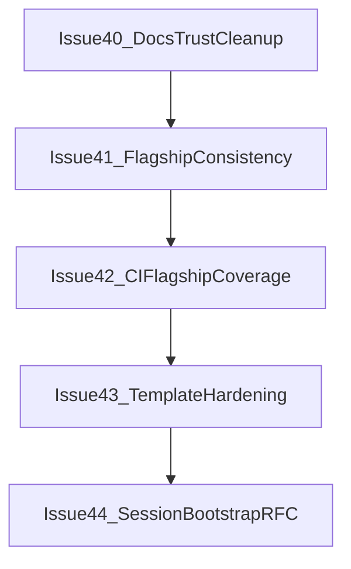

# Post-v0.3 Stabilization Roadmap

This document tracks immediate post-`0.3.0` priorities before any SaaS-style expansion work.

## Milestone

- [`v0.3.x stabilization`](https://github.com/devallibus/gametau/milestone/4)

## Issues

1. [#40 Docs trust cleanup (SECURITY/CONTRIBUTING/templates)](https://github.com/devallibus/gametau/issues/40)
2. [#41 Flagship consistency decision (README/site/pages)](https://github.com/devallibus/gametau/issues/41)
3. [#42 CI gap closure for battlestation example](https://github.com/devallibus/gametau/issues/42)
4. [#43 Template loop hardening (session/comms side effects)](https://github.com/devallibus/gametau/issues/43)
5. [#44 Session bootstrap-on-load RFC (local-first)](https://github.com/devallibus/gametau/issues/44)

## Execution Order

## Scope Guardrails

- Keep current work local-first and non-predatory.
- Defer managed SaaS capabilities until this stabilization sequence is complete.
- Use issue acceptance criteria as release gate for each step.
