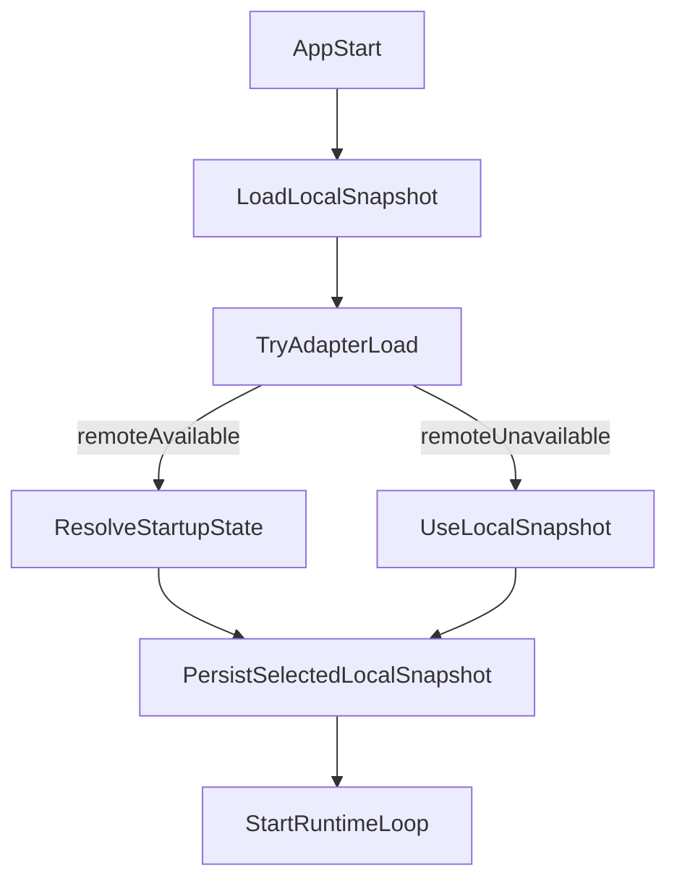

# RFC: Session Bootstrap on Load (Local-First)

## Status

- Proposed for post-`0.3.0` stabilization (`#44`)
- Scope: load-time session bootstrap only

## Objective

Provide a deterministic way to hydrate session state at app startup from a shared source when available, while preserving local-first behavior when offline or unconfigured.

This RFC does **not** introduce managed hosting requirements or continuous cross-device sync.

## Why Now

- Current session storage is local-only (`webtau/fs` + `webtau/path` seams).
- Teams need shared startup checkpoints for demos/training/testing.
- Full real-time sync adds infrastructure and support burden that does not fit current project stage.

## Non-Goals

- Continuous bi-directional sync between desktop and web players
- Real-time conflict reconciliation while running
- Managed cloud control plane requirements
- Auth/provider lock-in

## Identity Model

Every bootstrappable session record must include:

- `session_id`: stable logical identifier for the scenario/checkpoint
- `updated_at`: ISO timestamp for freshness and merge policy
- `source_env`: environment that wrote the record (`web`, `desktop`, `ci`, etc.)

Optional but recommended:

- `schema_version`: payload compatibility marker
- `source_instance`: writer identifier for diagnostics

## Adapter Contract (Draft)

```ts
export interface SessionBootstrapRecord<TView> {
  session_id: string;
  updated_at: string;
  source_env: string;
  payload: TView;
  schema_version?: string;
  source_instance?: string;
}

export type BootstrapMergePolicy = "prefer_remote" | "prefer_local" | "lww";

export interface SessionBootstrapAdapter<TView> {
  load(sessionId: string): Promise<SessionBootstrapRecord<TView> | null>;
  save?(record: SessionBootstrapRecord<TView>): Promise<void>;
}
```

## Load-Time Behavior

Default behavior (`prefer_remote`):

1. Load local snapshot from existing local service seam.
2. Attempt adapter `load(sessionId)`.
3. If remote exists and validates, use remote payload for startup.
4. If remote is unavailable/invalid, continue with local snapshot.
5. Persist selected startup snapshot locally and expose source in UI/logs.

### `prefer_local` behavior

1. Load local snapshot from existing local service seam.
2. Attempt adapter `load(sessionId)`.
3. Always use local snapshot for startup, regardless of remote availability.
4. If local is absent and remote exists, use remote as fallback.
5. Persist selected startup snapshot locally.

### `lww` (last-writer-wins) behavior

1. Load local snapshot from existing local service seam.
2. Attempt adapter `load(sessionId)`.
3. Compare `updated_at` timestamps; use whichever is more recent.
4. If timestamps are equal, prefer local (tie-breaking toward local-first).
5. Persist selected startup snapshot locally.

Custom resolver behavior:

- Consumers may provide `resolve(local, remote)` for domain-specific merges.
- Resolver runs only during startup bootstrap, not continuously.

## Flow



## Local-First Guarantees

- App remains functional with no adapter configured.
- Adapter failures never block startup.
- Local snapshot remains the fallback source of truth for boot.
- Export/import remains possible without provider-specific formats.

## Provider Notes

The adapter boundary allows multiple backends without changing app logic:

- SQLite WASM / OPFS baseline (local)
- Turso (remote sqlite)
- PlanetScale via server-side adapter route
- SpacetimeDB adapter path

No provider is required for baseline operation.

## Suggested Integration Points

- `packages/create-gametau/templates/base/src/services/contracts.ts` (adapter interface types)
- `packages/create-gametau/templates/base/src/services/session.ts` (bootstrap merge entry)
- `packages/create-gametau/templates/base/src/services/index.ts` (optional adapter injection)
- `packages/create-gametau/templates/base/src/index.ts` (startup flow + source marker)

## Implementation Slice (Minimal)

1. Add optional adapter types and merge policy enum.
2. Add startup bootstrap hook in `session` service (`loadBootstrap(sessionId, options)`).
3. Wire startup call in template `index.ts` before game loop begins.
4. Add unit tests for:
   - local fallback on adapter failure
   - `prefer_remote` default behavior
   - custom resolver branch
5. Keep `saveSnapshot` runtime behavior unchanged (no continuous sync).
